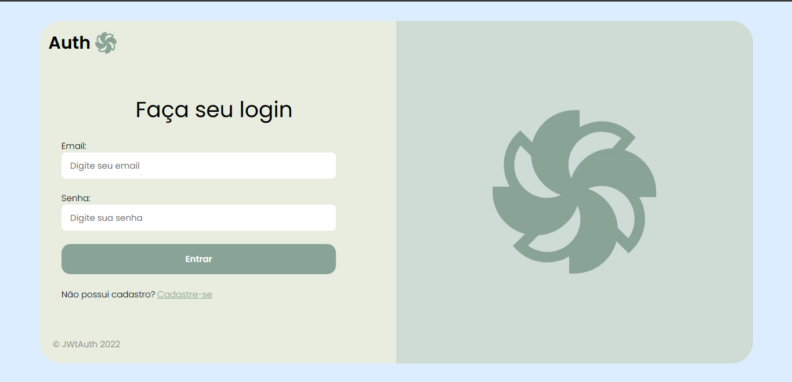

## 🧪 Tecnologies:
This project was built with the technologies below:

- [NodeJs](https://nodejs.org/)
- [TypeScript](https://www.typescriptlang.org/)
- [TypeORM](https://typeorm.io/)
- [PostgreSQL](https://www.postgresql.org/)
- [React](https://reactjs.org/)
- [Axios](https://axios-http.com/ptbr/)

___

## 🚀 About

This project is a JWT authentication api (JsonWebToken) made with postgreSQL and TypeOrm. Has one a client side just to consume the API.

___

## 📝 The project

---

Made with 💜 by Guilherme Matosoli
